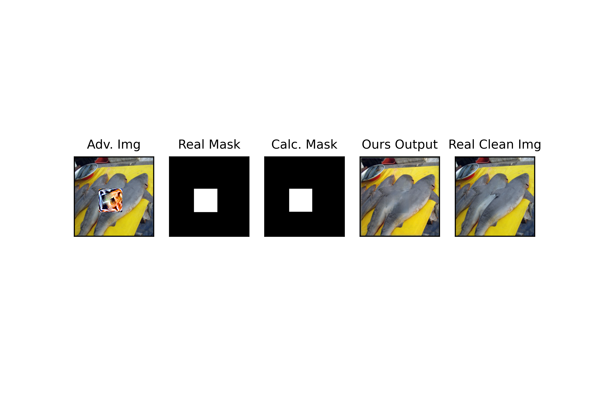

# Defense against Adversarial Patch

In this work, we attempt to dispense with [Adversarial Patch](https://arxiv.org/pdf/1712.09665.pdf). We do so in two steps:

**STEP1: Localizing the Patch**: We observe that an adversarial patch engrosses the attention of a neural network almost completely. Hence the [GradCam](https://arxiv.org/pdf/1610.02391.pdf) creates a saliency map at which the location of the patch has high values and the rest, close to zero.

Using this observation, on the first step, we calculate the GradCam for an input image, possibly containing an adversarial patch. We suspect that if the mage contains a Patch, the attention of the network would be extremely dense. Therefore, using the density of the heat map created by the adversarial patch, we determine whether there is a patch or not.

We first blur the saliency maps for the input image. Then, using a threshold, we make the image to 0 and 1 values. 

---

---

As you can see, the predicted place of the patch is sparse and have lots of black dots inside of it. An ideal localization of patch would have no black dots inside and no white dots on the outside. A very simple yet effective algorithm is to calculate the first and last X and Y coordinates at which a white dot was seen. Using these 4 values, we can create a square and have the patch localized. However, if there are any outliers (any white dot outside the desirable square), the performance of our localization will suffer immensely.

**With outlier**:
---

---

**Without outlier**:
---

---

In order to handle these outliers and make the saliency map dense, we first process the thresholded saliency map. If the white dots in each row and column are less than a threshold (Default: <=3) then we don't consider those white dots. This way, these outliers are dispensed with.

**Handled outlier**:
---

---

**STEP2: Removing the patch**:
Thereon, after localizing the adversarial perturbation, we feed the input image with the predicted patch location to a pretrained [Image Inpainting](https://github.com/daa233/generative-inpainting-pytorch) model. Here we exhibit several sample results. (For the inpainting model to work, please download the corresponding config.yaml and pretrained model by going to [this link](https://github.com/daa233/generative-inpainting-pytorch).)

---

---

**Examples**:
Here are several examples.

Example1:
Coordinates of vertice of the real mask (the exact place that the adversarial patch was at):
(139,145) , (204,145) , (139,210) , (204,210)
Coordinates of vertice of the calculated mask (where we predict the mask would be at):
(138,145) , (206,145) , (138,210) , (206,210)

---

---

Example2:
Coordinates of vertice of the real mask (the exact place that the adversarial patch was at):
(90,69) , (155,69) , (90,134) , (155,134)
Coordinates of vertice of the calculated mask (where we predict the mask would be at):
(90,69) , (155,69) , (90,134) , (155,134)

---

---

Example3:
Coordinates of vertice of the real mask (the exact place that the adversarial patch was at):
(74,148) , (139,148) , (74,213) , (139,213)
Coordinates of vertice of the calculated mask (where we predict the mask would be at):
(72,148) , (140,148) , (72,213) , (140,213)

---

---

(In these examples, our masks either captured the Patches precisely, or covered the patch and were a tad bigger than the real patch. It is perfectly fine since the Inpainting model will handle these areas.)
